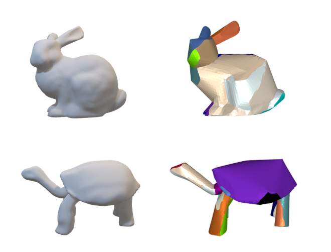

# Developable Approximation

## The main ways is Gauss feature, and spherical clustering, shape approximation。Adding post-processing, such as cutting algorithms, can facilitate manufacturing

## The result and the Guass map presentation : 

